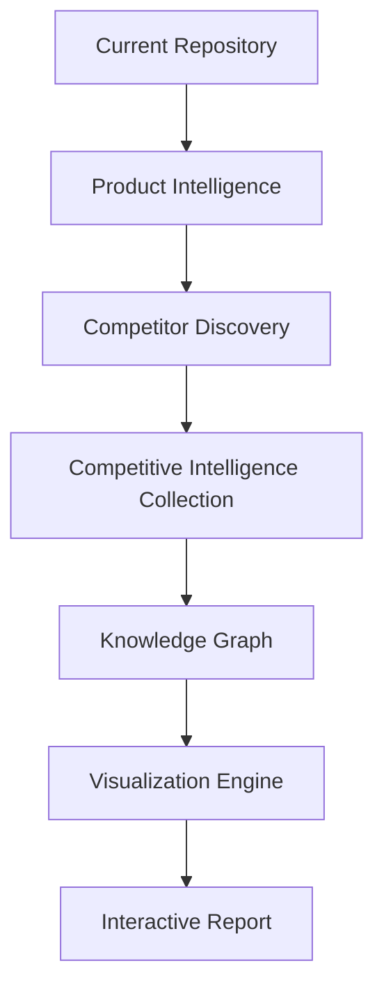

# InsightKit Competitive Intelligence Platform

## Product Requirements Document

**Version:** v1  
**Scope:** Comprehensive research and competitive intelligence

---

## 1. Mission

InsightKit automatically analyzes the current repository, identifies the product, discovers competitors, and builds a complete competitive intelligence database across product, technology, business, marketing, SEO, social, customer, sales, hiring, funding, and brand positioning signals.

The objective is to become an **AI Product Research Assistant**, not simply a comparison generator.

---

## 2. Research Pipeline



---

## 3. Product Intelligence

InsightKit extracts the following signals from the local repository.

### 3.1 Product Identity

- Product name
- Tagline
- Description
- Product category
- Product stage
- OSS or SaaS
- Business model
- Pricing model

### 3.2 Features

- Core features
- AI capabilities
- Platforms
- Integrations
- APIs
- Target workflow

### 3.3 Customers

- Target users
- Industry
- Company size
- Personas
- Use cases

---

## 4. Competitor Discovery

InsightKit automatically discovers and classifies competitors across the following categories:

- Direct competitors
- Indirect competitors
- Enterprise competitors
- Open-source alternatives
- Emerging startups
- Adjacent products

Each discovered competitor should be classified by competitive relationship and relevance.

---

## 5. Company Profile

For each competitor, collect:

- Company name
- Official website
- Headquarters
- Founded year
- Founders
- Employee estimate
- Funding stage
- Investors
- Estimated ARR, when publicly available
- Open-source or commercial status

---

## 6. Official Online Presence

For every competitor, collect official links and public distribution channels.

### 6.1 Website

- Homepage
- Pricing
- Documentation
- Blog
- Changelog
- Careers
- API docs

### 6.2 Social Media

- X
- LinkedIn
- GitHub
- YouTube
- Discord
- Slack Community
- Reddit
- Facebook
- Instagram
- TikTok
- Product Hunt

### 6.3 Developer Channels

- GitHub repository
- GitHub stars
- GitHub forks
- GitHub issues
- GitHub releases
- npm package
- PyPI
- Docker Hub
- VSCode Marketplace

---

## 7. Product Information

For each competitor product, collect:

- Features
- Pricing
- Free plan
- Enterprise plan
- Integrations
- AI models
- API availability
- SDKs
- Mobile apps
- Browser extension

---

## 8. Technology Intelligence

Identify the competitor's technology stack where possible.

### 8.1 Stack Categories

- Frontend
- Backend
- Hosting
- Cloud provider
- Authentication
- Analytics
- Payments
- Monitoring
- CMS
- Database
- CDN
- LLM provider
- Inference provider
- Framework
- Deployment

### 8.2 Example Technologies to Infer

- React
- Next.js
- Vue
- Astro
- Django
- Rails
- Laravel
- FastAPI
- Cloudflare
- Vercel
- AWS
- GCP
- Azure
- Stripe
- Clerk
- Supabase
- Firebase
- OpenAI
- Anthropic
- Other relevant technologies

---

## 9. SEO Intelligence

Collect and analyze:

- Meta title
- Meta description
- Sitemap
- Robots.txt
- Indexed pages
- Keyword focus
- Blog frequency
- Landing pages
- Documentation quality
- Internal linking

---

## 10. Marketing Intelligence

Collect and analyze:

- Positioning statement
- Hero headline
- Value proposition
- CTA
- Pricing strategy
- Product launch style
- Newsletter
- Webinar
- Referral program
- Affiliate program
- Community
- Case studies
- Customer stories
- Email capture strategy

---

## 11. Content Marketing

Analyze:

- Blog topics
- AI-generated content
- Documentation
- Tutorials
- Videos
- Podcasts
- Newsletter
- Changelog
- Release cadence

---

## 12. Social Media Intelligence

For every platform, collect:

- Official account
- Followers, when publicly visible
- Posting frequency
- Content categories
- Engagement style
- Product announcements
- Community interaction
- Video strategy
- Influencer collaborations

---

## 13. Customer Intelligence

Identify:

- Customer segments
- Industries
- Team size
- Developer audience
- Enterprise audience
- Startup audience
- Agencies
- Education
- SMB
- Target pain points

---

## 14. Sales Intelligence

Collect:

- Free trial
- Freemium
- Enterprise contact
- Self-service motion
- Annual discount
- Demo booking
- Sales team
- Partner program
- Marketplace presence

---

## 15. Hiring Intelligence

Collect:

- Career page
- Open positions
- Engineering hiring
- AI hiring
- Remote policy
- Technology hints from job descriptions

---

## 16. Product Signals

Monitor:

- New features
- Changelog
- GitHub releases
- Product Hunt launches
- Funding announcements
- Pricing changes
- Website redesigns
- New integrations

---

## 17. Visualizations

The interactive report should support:

- Executive dashboard
- Company cards
- Comparison matrix
- Feature heatmap
- Pricing matrix
- Radar chart
- Technology stack matrix
- Social presence matrix
- SEO scorecard
- Marketing funnel
- Target customer matrix
- Positioning matrix
- SWOT
- Opportunity gap analysis
- Recommendation engine

---

## 18. Normalized JSON Output

InsightKit should generate one normalized dataset. Every visualization should consume this schema instead of scraping directly.

### 18.1 Dataset Files

- `product.json`
- `competitors.json`
- `companies.json`
- `social.json`
- `marketing.json`
- `techstack.json`
- `seo.json`
- `pricing.json`
- `report.json`

### 18.2 Output Requirement

All downstream views, reports, and visualizations should read from the normalized schema to keep data collection, analysis, and presentation decoupled.

---

## 19. Future Monitoring

InsightKit should eventually support a competitor monitoring workflow:

```text
/watch-competitors
```

Daily or weekly updates should monitor:

- Pricing changes
- New features
- New blog posts
- Hiring trends
- GitHub releases
- Social media activity
- Funding news
- SEO changes

This turns InsightKit into a continuous competitive intelligence platform rather than a one-time report generator.
